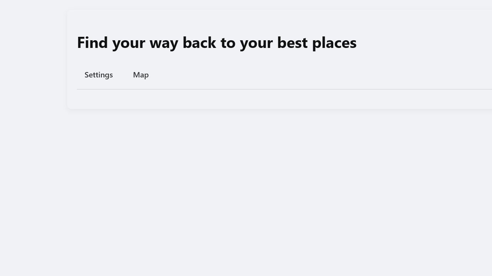
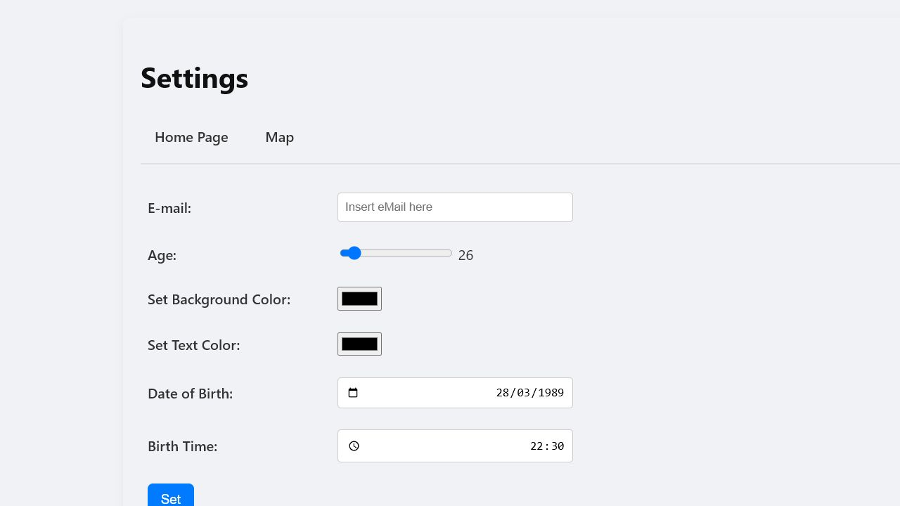
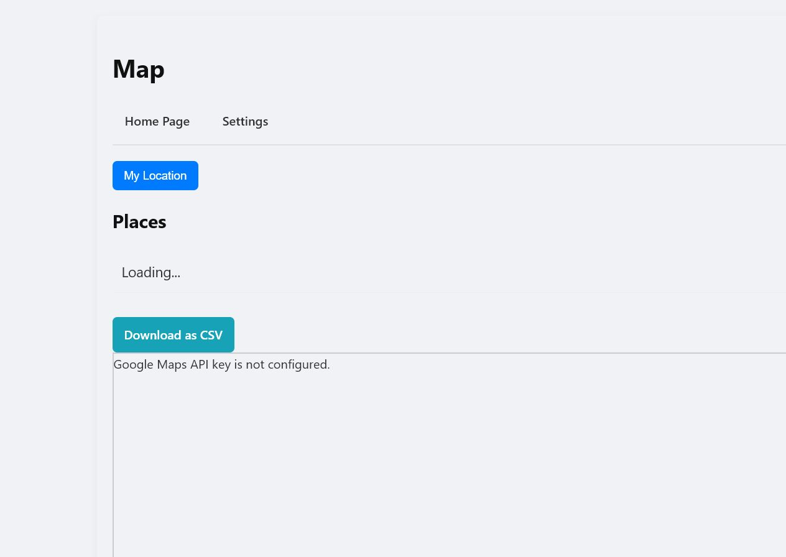

# PlaceKeeper

## Project Title And Status

PlaceKeeper is a Coding Academy browser exercise for saving favorite places and
revisiting them on a Google Map.

- Repository type: Coding Academy
- Repository state: Experimental
- Release status: Not release-ready yet; the project should be treated as
  experimental until the remaining repository and product blockers are resolved

## Overview

PlaceKeeper is a small static web app built with plain HTML, CSS, and
JavaScript. It lets a user keep a lightweight personal places list, store that
data in the browser, and jump between saved places on a Google Map.

The current project is intentionally simple:

- no backend service
- no application build pipeline
- lightweight automated validation plus manual browser QA
- browser persistence through `localStorage`
- lightweight local Node tooling only for static serving

## Features

- Home page with quick navigation to settings and the map view
- Settings page for saving user preferences such as colors, age, date of birth,
  and birth time
- Map page with Google Maps integration for viewing and creating saved places
- Place management actions for adding, listing, focusing, and deleting places
- CSV export for the saved places list
- Local persistence for both places and user preferences

## Screenshots Or Demo

Repository-managed screenshots are available under `docs/screenshots/`.

### Home Page



### Settings Page



### Map Page



The map screenshot intentionally captures the safe missing-key fallback state.
This keeps the repository free of live API-backed map data, personal browser
state, and sensitive location details.

A live GitHub Pages demo is available at
[aviad-benhamo.github.io/ca-placekeeper](https://aviad-benhamo.github.io/ca-placekeeper/).

The deployed demo keeps the repository-safe configuration model:

- `index.html` and `user-prefs.html` are available directly on GitHub Pages
- `map.html` remains safe when no `js/maps-config.js` file is deployed
- the map view shows the documented missing-key configuration message instead of
  exposing a real Google Maps API key

## Quick Start

1. Clone the repository.
2. Install the recommended Node.js version from `.nvmrc`, or use a compatible
   Node 24 release.
3. Install dependencies:

   ```sh
   npm install
   ```

4. Copy `js/maps-config.example.js` to `js/maps-config.js`.
5. Replace `YOUR_GOOGLE_MAPS_API_KEY` with a restricted Google Maps browser
   key.
6. Start the local static server:

   ```sh
   npm run serve
   ```

7. Open `http://localhost:8000/index.html` in a browser.

Python remains a valid fallback for environments that do not want Node-based
tooling:

   ```sh
   python -m http.server 8000
   ```

You can also open `index.html` directly from the filesystem for basic flows,
but a local static server is the safer default for manual QA and future asset
loading changes. The recommended repository workflow is the local static server.

## Configuration

The map experience depends on the Google Maps JavaScript API.

- Local configuration file: `js/maps-config.js`
- Tracked template: `js/maps-config.example.js`
- Global key contract: `window.PLACEKEEPER_MAPS_API_KEY`
- Git policy: `js/maps-config.js` must stay untracked because it can contain a
  local API key

Recommended setup:

1. Create a browser key in Google Cloud.
2. Restrict the key to the Google Maps JavaScript API.
3. Add HTTP referrer restrictions for the local and deployed origins that are
   allowed to use the key.
4. Keep production or unrestricted keys out of this repository.

If the key is missing or still set to the placeholder value, `map.html` shows a
configuration message instead of loading Google Maps.

For more detail, see [docs/maps-configuration.md](docs/maps-configuration.md).
For the local run workflow, see
[docs/local-development.md](docs/local-development.md).
For the validation workflow, see
[docs/validation-workflow.md](docs/validation-workflow.md).
The repository also runs the same automated validation bundle in GitHub Actions.

## Project Structure

```text
.
|-- css/
|   `-- main.css
|-- docs/
|   |-- maps-configuration.md
|   `-- screenshots/
|       |-- placekeeper-home.png
|       |-- placekeeper-map.png
|       `-- placekeeper-settings.png
|-- js/
|   |-- maps-config.example.js
|   |-- map.controller.js
|   |-- main.controller.js
|   |-- placeService.js
|   |-- user-prefs.controller.js
|   |-- userService.js
|   `-- utilService.js
|-- index.html
|-- map.html
`-- user-prefs.html
```

## Development Notes

- The app uses plain browser globals and script tags rather than modules or a
  bundler.
- `package.json` exists only to provide a consistent local static server
  workflow for contributors.
- User preferences are stored under the `userPrefsDB` local storage key.
- Saved places are stored under the `placeDB` local storage key.
- Initial sample places are seeded when no places exist in local storage.
- The map page loads the Google Maps script dynamically after validating the
  configured API key.

## Browser Assumptions And Limitations

- Use a modern desktop browser with JavaScript enabled.
- `localStorage` is required for persistent places and user preferences.
- Google Maps requires network access plus a valid browser API key.
- Geolocation is optional and depends on browser support and user permission.
- Location testing is more reliable on `http://localhost` than on direct
  `file://` pages.

## Manual QA

PlaceKeeper uses a hybrid validation workflow:

- automated baseline checks with `npm run validate`
- manual browser QA for interactive map behavior

The full workflow is documented in
[docs/validation-workflow.md](docs/validation-workflow.md).

Recommended checks:

1. Open `index.html` and verify the navigation links to Settings and Map.
2. Open `user-prefs.html`, save preferences, and confirm the selected colors
   apply after reloading pages.
3. Run `npm run serve` and verify `http://localhost:8000/index.html` loads.
4. Open `map.html` without `js/maps-config.js` and confirm the configuration
   warning appears.
5. Add a valid `js/maps-config.js`, reload `map.html`, and confirm the map
   initializes.
6. Click the map to add a place, then verify `Go`, delete, and CSV download
   behavior.
7. Trigger `My Location` in a browser that supports geolocation and confirm the
   map recenters after permission is granted.
8. Search the repository for committed Google Maps keys before publishing:

   ```sh
   rg "AIza[0-9A-Za-z_-]+" .
   ```

## Validation Command

Run this before considering a task complete:

```sh
npm run validate
```

This covers the lightweight automated regression checks for local persistence,
CSV export, missing-key fallback behavior, and committed-key scanning.

GitHub Actions runs the same validation command on pushes to `main` and on pull
requests.

## AI Notice

This repository may be maintained with help from AI coding assistants. All
AI-assisted changes should be reviewed by a human maintainer before merge,
release, or publication.

## Changelog And Release References

See [CHANGELOG.md](CHANGELOG.md) for pending and released repository changes.

The repository currently uses `0.1.0` as its initial versioning baseline while
the project is still experimental.

Keep all pending work under `[Unreleased]` until a deliberate release
preparation step moves the validated changes into a numbered section such as
`[0.1.0]`.

Every release must use a Git tag in the format `vMAJOR.MINOR.PATCH`.

Do not create a public or stable release until the remaining security and
repository-baseline blockers are resolved.

## License

This project is licensed under the MIT License. See [LICENSE](LICENSE).
